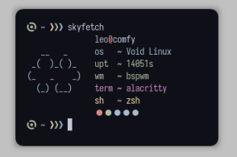

<div align="center">
  <h2>skyfetch ☁️</h2>
  <p>a system information fetch written in rust :crab:</p>
  
  
</div>

## requirements

- cargo
  - install with `curl https://sh.rustup.rs -sSf | sh` or use install script of skyfetch

## installation 

```
git clone https://github.com/justleoo/skyfetch
cd skyfetch
cargo install --path .
```

and use `skyfetch` command in your terminal!

## thanks :heart:

[yxqsnz](https://github.com/yxqsnz) improve code quality

[S0raWasTaken](https://github.com/s0rawastaken) capture variable in string

## license

MIT.
