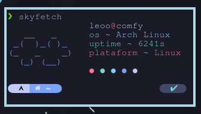

## skyfetch ☁️

a system information fetch written in rust



## requirements

- cargo
  - install with `curl https://sh.rustup.rs -sSf | sh`

## installation 

manual installation

```
git clone https://github.com/justleoo/skyfetch
cd skyfetch
cargo install --path .
```

using install script

```curl https://raw.githubusercontent.com/justleoo/skyfetch/main/install.sh | bash```

and use `skyfetch` command in your terminal!
